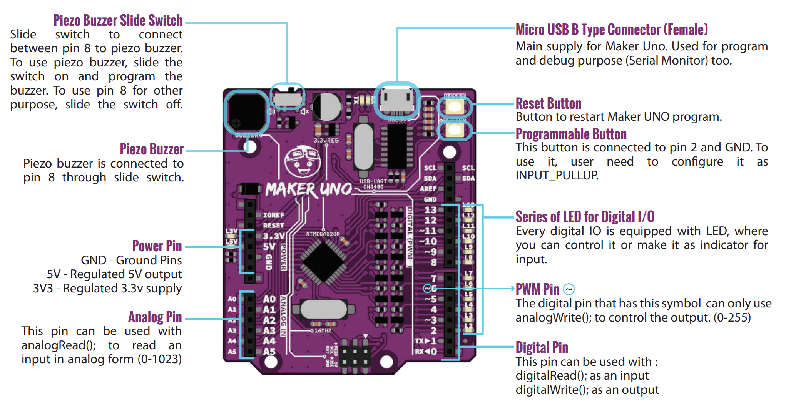
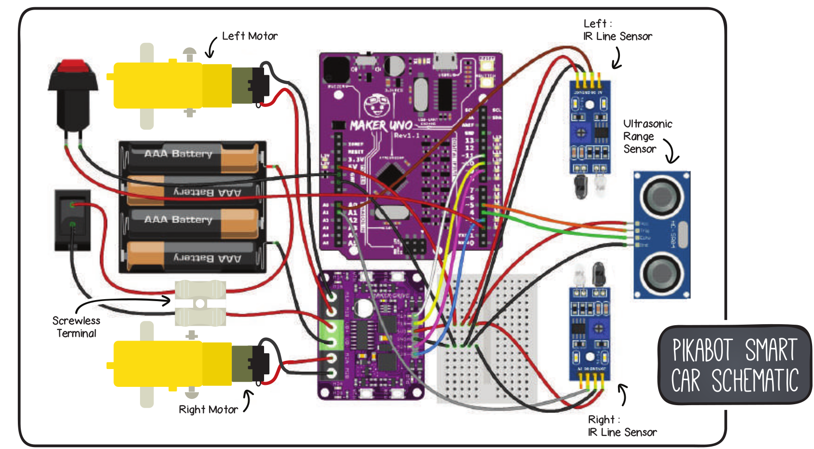
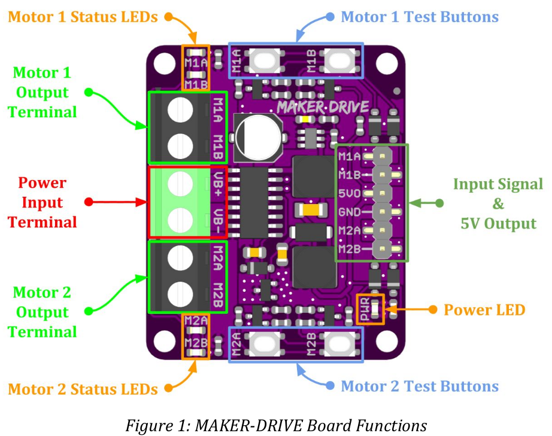
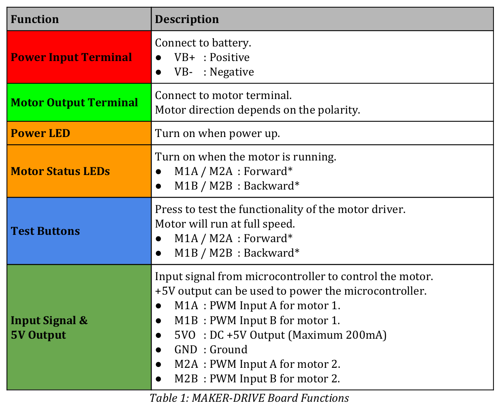
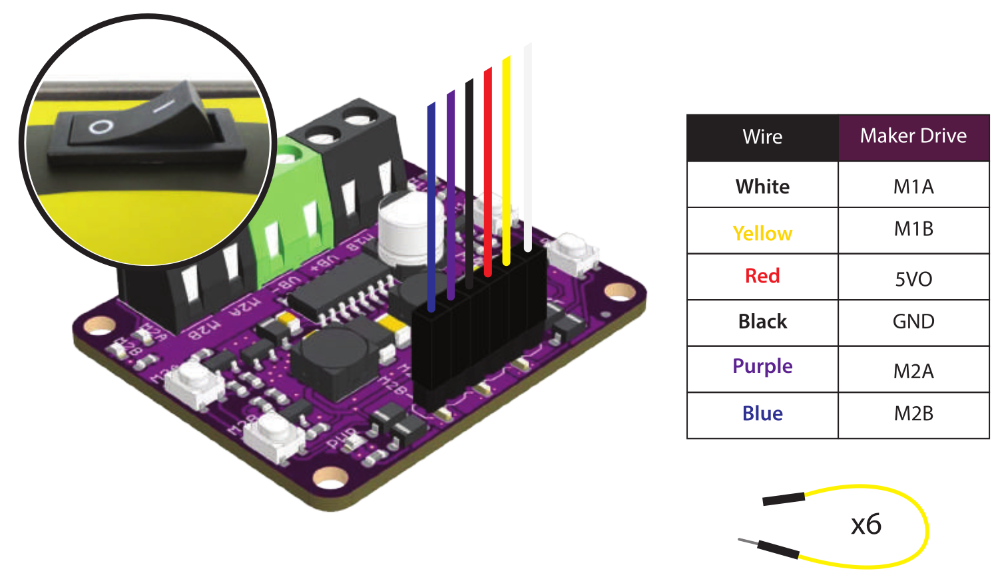
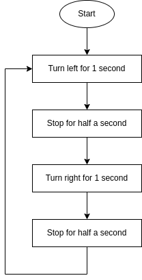

# PikaBot

## References
- [Kit](https://www.robotshop.com/de/de/pikabot-maker-uno-smart-car-kit.html)
- [Arduino IDE](https://www.arduino.cc/en/software)
  - The Arduino IDE from Ubunut 22.04 Repo didn't work.
  - To get ttyUSB0 working, some brail service must get disabled. dmesg showed the issue
- The PikaBot is using an [Cytron Maker Uno](https://www.robotshop.com/de/de/cytron-maker-uno-mikrocontroller.html)




## Prepare Arduino IDE
- Install Cytron Motor Drivers Library

## PikaBot Book
- Example projects using the Arduino IDE.
- [Git](https://github.com/liebhaberei/PikaBotBook)



### Project 1 - Let's move it

#### Project 1.1 - Move forward

The first code example:
``` c
#include <CytronMotorDriver.h>

CytronMD motorLeft(PWM_PWM, 11, 10);
CytronMD motorRight(PWM_PWM, 9, 3);

void setup() { }

void loop() {
    motorLeft.setSpeed(200);
    motorRight.setSpeed(200);
}
```

##### Cytron Motor Driver




| Description | Arduino | Maker Drive | Description   |
| ----------- | ------- | ----------- | ------------- |
|  PB3/OC2A   | 11      | M1A         | PWM A motor 1 |
|  PB2/OC1B   | 10      | M1B         | PWM B motor 1 |
|  PB1/OC1A   |  9      | M2A         | PWM A motor 2 |
|  PB3/OC2B   |  3      | M2B         | PWM B motor 2 |

| Input A | Input B | Ouput A | Output B | Description |
| ------- | ------- | ------- | -------- | ----------- |
| Low     | Low     | Low     | Low      | Break       |
| High    | Low     | High    | Low      | Forward     |
| Low     | High    | Low     | High     | Backward    |
| High    | High    | Open    | Open     | Coast       |

##### Cytron Motor Drivers Library
[Git](https://github.com/CytronTechnologies/CytronMotorDriver)

``` c++
enum MODE {
  PWM_DIR,
  PWM_PWM,
};
```

``` c++
class CytronMD
{
  public:
    CytronMD(MODE mode, uint8_t pin1, uint8_t pin2);
    void setSpeed(int16_t speed);
    
  protected:
    MODE _mode;
  	uint8_t _pin1;
    uint8_t _pin2;
};
```
setSpeed implementation:
``` c++
    case PWM_PWM:
      if (speed >= 0) {
        analogWrite(_pin1, speed);
        analogWrite(_pin2, 0);
      } else {
        analogWrite(_pin1, 0);
        analogWrite(_pin2, -speed);
      }
      break;
```

###### analogWrite()

[Arduino analogWrite](https://www.arduino.cc/reference/en/language/functions/analog-io/analogwrite/)

Writes an analog value (PWM wave) to a pin. Can be used to light a LED at varying brightnesses or drive a motor at various speeds. After a call to analogWrite(), the pin will generate a steady rectangular wave of the specified duty cycle until the next call to analogWrite() (or a call to digitalRead() or digitalWrite()) on the same pin.

#### Project 1.2 - Move by time

``` c
#include <CytronMotorDriver.h>

CytronMD motorLeft(PWM_PWM, 11, 10);
CytronMD motorRight(PWM_PWM, 9, 3);

void setup() { }

void loop() {
    motorLeft.setSpeed(200);
    motorRight.setSpeed(200);
    delay(1000);

    motorLeft.setSpeed(0);
    motorRight.setSpeed(0);
    delay(500);
    
    motorLeft.setSpeed(-200);
    motorRight.setSpeed(-200);
    delay(2000);

    motorLeft.setSpeed(0);
    motorRight.setSpeed(0);
    delay(500);
}
```

##### delay()

[Arduino delay](https://www.arduino.cc/reference/en/language/functions/time/delay/)

Pauses the program for the amount of time (in milliseconds) specified as parameter. (There are 1000 milliseconds in a second.)

#### Project 1.3 - Move  functions

``` c
#include <CytronMotorDriver.h>

CytronMD motorLeft(PWM_PWM, 11, 10);
CytronMD motorRight(PWM_PWM, 9, 3);

void robotStop() {
  motorLeft.setSpeed(0);
  motorRight.setSpeed(0);
}

void robotMove(int speedLeft, int speedRight) {
  motorLeft.setSpeed(speedLeft);
  motorRight.setSpeed(speedRight);
}


void setup() { }

void loop() {
  robotMove(-200, 200); // turn left
  delay(1000);

  robotStop();
  delay(500);

  robotMove(200, -200); // turn right
  delay(2000);

  robotStop();
  delay(500);
}
```



#### Project 1 - Challenge

``` c
#include <CytronMotorDriver.h>

#define TIME_30_DEG 400 // time depends on battery state and hardware

CytronMD motorLeft(PWM_PWM, 11, 10);
CytronMD motorRight(PWM_PWM, 9, 3);

void robotStop() {
  motorLeft.setSpeed(0);
  motorRight.setSpeed(0);
}

void robotMove(int speedLeft, int speedRight) {
  motorLeft.setSpeed(speedLeft);
  motorRight.setSpeed(speedRight);
}

void circle() {
  robotMove(100, 200);  // move inner wheel slower than outer wheel
  delay(5000);

  robotStop();
}

void rectangle() {
  for(int i=0; i<4; i++) {
    robotMove(200, 200);
    delay(2000);
  
    robotMove(-200, 200);
    delay(3 * TIME_30_DEG); // 90°
  }

  robotStop();
}

void triangle() {
  for(int i=0; i<3; i++) {
    robotMove(200, 200);
    delay(2000);
  
    robotMove(-200, 200);
    delay(4 * TIME_30_DEG); // 120°, outer angel of triangle
  }

  robotStop();
}


void setup() { }

void loop() {
  circle();

  delay(1000);

  rectangle();
  
  delay(1000);

  triangle();
  
  delay(1000);
}
```
